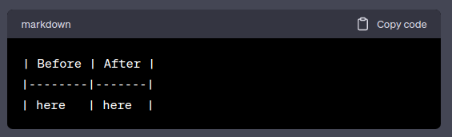
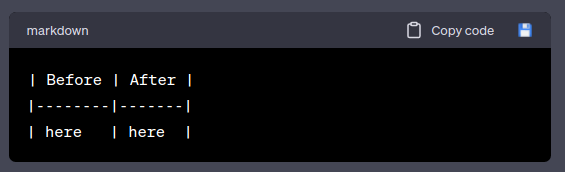

# ChatBot Code File Saver

## What is this?
Often, in ChatGPT, I'll ask it to create some example code or whip up a small script for me, but I don't like having to copy the code and paste it over my existing code or create a new file to put the code in.  This Chrome extention solves that problem by placing download links next to the existing "Copy code" links.

## How to install:
1. Download this code.
2. Go to [chrome://extensions](chrome://extensions)
3. Click the switch in the top right to enable *Developer Mode*
4. Click the *Load Unpacked button* in the top left and navigate to the directory where you stored this code.
5. Close the Extentions page
6. Click the Extentions puzzle piece in the browser bar on the right and then click the pin to pin this extension.

## How to use:
1. After you've gotten some code back from ChatGPT, click the extention to make it add download links (it will add them for the last 5 code blocks).
2. To download a code block, click a download link (the little floppy disk). It will initiate a file download with the contents of the code block as the file and the filename that was above the block as the filename in the Save As dialog.  If there was no filename, it will default to *code.txt*.

## Screenshots
| Before | After |
|--------|-------|
|    |   |

## To Do:
- Make the popup useful.  Just click the *Close* button when it pops up for now.

## Other Notes
- I'm not great at creating Chrome extensions, but I'm learning.
- ChatGPT 3.5 wrote most of this extension
- If you see something to improve, feel free to create a pull request or an issue.

## Credit
<a href="https://www.flaticon.com/free-icons/save-file" title="save file icons">Save file icons created by Flat Icons - Flaticon</a>